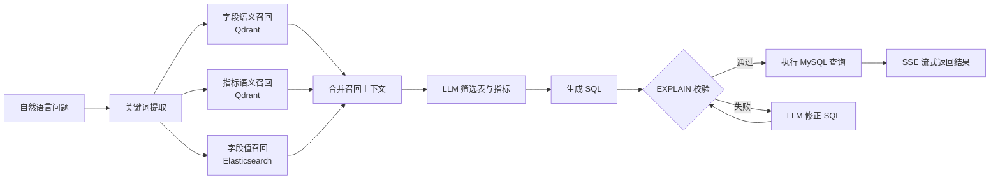

<h1 align="center">Data Agent</h1>

<p align="center">
  面向数据仓库的自然语言数据查询智能体
</p>

<p align="center">
  <a href="https://github.com/locip123/dataWarehouseAgent"></a>
  <a href="https://fastapi.tiangolo.com/"></a>
  <a href="https://langchain-ai.github.io/langgraph/"></a>
  <a href="https://vuejs.org/"></a>
  <a href="https://github.com/locip123/dataWarehouseAgent/stargazers"></a>
</p>

<p align="center">
  <a href="#-项目简介">项目简介</a> ·
  <a href="#-核心能力">核心能力</a> ·
  <a href="#-快速开始">快速开始</a> ·
  <a href="#-工作流程">工作流程</a> ·
  <a href="#-接口说明">接口说明</a> ·
  <a href="#-项目结构">项目结构</a>
</p>

---

## 📊 项目简介

**Data Agent** 是一个面向数据仓库的自然语言查询项目。用户输入诸如“查询订单总数”或“华东地区本月 GMV”的问题后，系统会从元数据、指标定义和字段值中召回上下文，生成并校验 SQL，最后以流式方式返回执行进度和查询结果。

项目内置了订单主题的演示数据与元数据配置，可作为构建企业数据问答、Text-to-SQL 或指标查询助手的基础示例。

### 核心亮点

- **自然语言查询**：将中文业务问题转换为可执行 SQL。
- **混合元数据召回**：Qdrant 召回字段与指标语义信息，Elasticsearch 召回字段值。
- **元数据驱动**：通过 YAML 定义表、字段、别名和业务指标，减少提示词中的硬编码。
- **SQL 校验与纠错**：先使用 `EXPLAIN` 校验；数据库错误时自动进入 SQL 修正流程。
- **实时反馈**：后端以 Server-Sent Events（SSE）持续输出各节点进度、结果或错误；Vue 前端实时展示。

---

## ✨ 核心能力

| 能力 | 说明 |
| --- | --- |
| 关键词提取 | 使用 `jieba` 从用户问题中抽取检索关键词。 |
| 字段与指标召回 | 基于向量检索召回相关字段、表和预定义业务指标。 |
| 字段值召回 | 从 Elasticsearch 检索可能的地区、品类、品牌等筛选值。 |
| 上下文筛选 | 使用 LLM 从召回信息中选择生成 SQL 所需的表、字段与指标。 |
| SQL 生成与修正 | 生成 SQL，使用 MySQL `EXPLAIN` 校验，并对可修正错误重新生成。 |
| 流式查询界面 | 展示运行步骤、表格结果和错误信息，便于观察 Agent 的执行过程。 |

---

## 🚀 快速开始

### 环境要求

- Python `>= 3.12`（推荐 Conda 环境：`dataagent`）
- Node.js `>= 20`
- Docker Desktop

### 1. 获取代码并安装依赖

```powershell
git clone https://github.com/locip123/dataWarehouseAgent.git
Set-Location .\dataWarehouseAgent

conda activate dataagent
python -m pip install -e .
```

前端依赖在后续步骤中单独安装。

### 2. 配置 LLM 与业务元数据

编辑 [`conf/app_config.yaml`](conf/app_config.yaml)，将 `llm` 配置为可用的 OpenAI 兼容服务：

```yaml
llm:
  model_name: your-model-name
  api_key: your-api-key
  base_url: https://your-llm-endpoint/v1
```

数据库、Qdrant、Elasticsearch 与嵌入服务的地址也在该文件中配置。默认端口与下文的 Docker Compose 服务对应。

随后按实际数仓模型编辑 [`conf/meta_config.yaml`](conf/meta_config.yaml)：

- 在 `tables` 中维护表、字段、字段角色、描述和业务别名；
- 在 `metrics` 中维护指标定义、描述、别名及相关字段；
- `sync: true` 的字段会参与字段值索引同步。

> [!WARNING]
> `conf/app_config.yaml` 包含 LLM 密钥字段。请使用自己的密钥，不要将真实密钥提交到版本库或公开分享。

### 3. 启动依赖服务并同步索引

```powershell
docker compose -f .\docker\docker-compose.yaml up -d
docker compose -f .\docker\docker-compose.yaml ps

conda activate dataagent
python -m app.scripts.sync_meta_data
```

首次启动、修改 `conf/meta_config.yaml`，或数据仓库中的可索引字段值发生变更后，都应重新执行同步命令。

> [!NOTE]
> 同步会重建 Qdrant 元数据集合，并替换 Elasticsearch 中已索引的字段值文档；请在生产环境中确认目标索引配置无误后再执行。

### 4. 启动后端

在项目根目录打开一个终端：

```powershell
conda activate dataagent
python -m uvicorn main:app --host 127.0.0.1 --port 8000
```

后端启动后监听 `http://127.0.0.1:8000`。

### 5. 启动前端

另开一个终端：

```powershell
Set-Location .\app\vue
npm ci
npm run dev
```

访问 Vite 输出的地址（默认是 `http://localhost:5173`）即可开始查询。开发服务器会将 `/api` 请求代理到后端 `http://localhost:8000`。

### 停止依赖服务

```powershell
docker compose -f .\docker\docker-compose.yaml down
```

---

## 🧩 工作流程



系统同时读取数据仓库的数据库信息，并将其与筛选后的元数据一并传给 SQL 生成节点。整个编排逻辑位于 [`app/agent/graph.py`](app/agent/graph.py)。

### 依赖服务

| 服务 | 默认地址 | 用途 |
| --- | --- | --- |
| MySQL | `localhost:3307` | 存放演示数仓数据与元数据。 |
| Elasticsearch | `http://localhost:9200` | 检索维度字段的具体取值。 |
| Kibana | `http://localhost:5601` | 查看 Elasticsearch 数据。 |
| Qdrant | `http://localhost:6333` | 检索表字段与指标的向量元数据。 |
| Embedding 服务 | `http://localhost:8081` | 生成元数据向量，默认模型为 `BAAI/bge-large-zh-v1.5`。 |

服务定义见 [`docker/docker-compose.yaml`](docker/docker-compose.yaml)。

---

## 🔌 接口说明

### 查询接口

`POST /api/query`

请求体：

```json
{
  "query": "查询订单总数"
}
```

响应类型为 `text/event-stream`。每个 SSE 消息的 `data` 是一段 JSON，常见事件如下：

| 事件类型 | 示例 | 含义 |
| --- | --- | --- |
| `progress` | `{"type":"progress","step":"生成SQL","status":"running"}` | Agent 节点开始、成功或失败。 |
| `result` | `{"type":"result","data":[...]}` | SQL 查询结果。 |
| `error` | `{"type":"error","message":"..."}` | 查询过程中发生的异常。 |

`query` 不能为空；空字符串请求会被 FastAPI 校验为 `422 Unprocessable Entity`。

---

## 🗂️ 项目结构

```text
dataWarehouseAgent/
├── app/
│   ├── agent/                 # LangGraph 状态、节点与 LLM 配置
│   │   ├── graph.py           # 查询 Agent 工作流
│   │   └── nodes/             # 召回、筛选、生成、校验与执行节点
│   ├── clients/               # MySQL、ES、Qdrant、Embedding 客户端
│   ├── conf/                  # 应用配置加载
│   ├── repositories/          # 数据与检索仓储层
│   ├── router/                # FastAPI 路由与 SSE 响应
│   ├── scripts/               # 元数据同步脚本
│   ├── services/              # 查询与元数据同步服务
│   └── vue/                   # Vue 3 + Vite 查询界面
├── conf/
│   ├── app_config.yaml        # 服务连接与 LLM 配置
│   └── meta_config.yaml       # 表、字段和业务指标定义
├── docker/                    # MySQL、ES、Qdrant、Embedding 服务编排
├── prompts/                   # SQL 生成、筛选与纠错提示词
├── tests/                     # 单元测试
├── main.py                    # FastAPI 应用入口
└── pyproject.toml             # Python 项目依赖与构建配置
```

---

## 🧪 测试

在项目根目录执行：

```powershell
conda activate dataagent
python -m unittest discover -s tests -v
```

测试覆盖 SQL 生成与校验、检索节点、元数据仓储、查询 SSE 服务以及进度事件等核心逻辑。

---

## 🤝 贡献

欢迎提交 Issue 和 Pull Request。新增功能或修改查询流程时，建议同时补充或更新 `tests/` 中相应的测试用例，并确保本地测试通过。

---

## 📄 说明

本项目当前未包含单独的开源许可证文件。使用、分发或对外发布前，请先明确适用的许可证与第三方依赖的许可要求。
